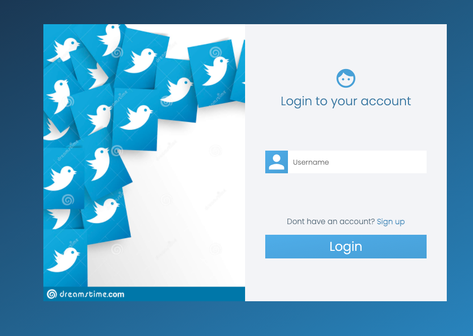
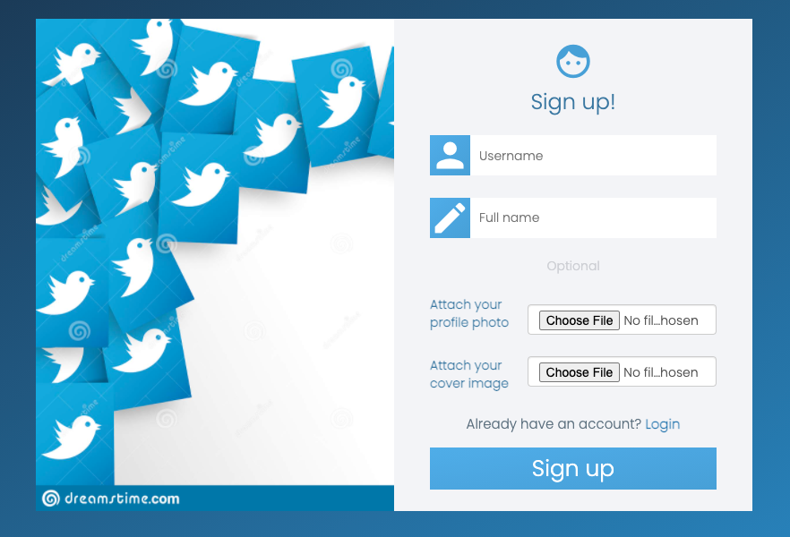
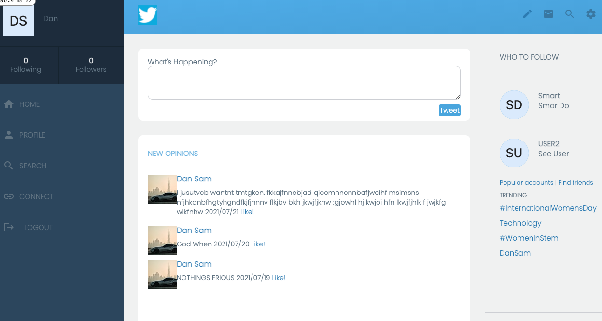
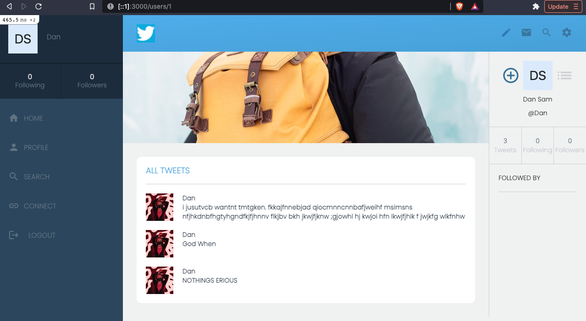

 ?style=plastic&logo=ruby>) ?style=plastic&logo=rails>)
# RoR-Twitter-Redesign Capstone Project

This project was intended to put my knowledge of Ruby on Rails module into practice through the Twitter-Redesign app that allows user to login, view homepage/tweets, suggestion on who to follow, access their user profile and those of others, and creating tweets.

I had the option to personalise the website and style it my own way. The end goal however was to create anything that someone could share opinions about with people who follow them and vice versa. The design I have emulated is by Design idea by [Gregoire Vella on Behance](https://www.behance.net/gregoirevella).

   
## Built With

- Ruby
- Ruby on Rails
- Visual Studio Code
- Git & Github
- Guard
- Bootstrap
- PostgreSQL
- RSPEC and Capybara
- Heroku

## Live Demo

- [Live Demo](https://nameless-waters-51440.herokuapp.com/)

- [Video](https://www.loom.com/share/a671d30c3bcd44d4b81e3ccf16319e1c)
- [Video 2](https://www.loom.com/share/0bf59866dbfa43259054a3aced0b0400)


## Getting Started

### Prerequisites

To get this project up and running locally, you must already have ruby and rails plus the necessary gems installed on your computer

### Install

- If you don't have **ruby** installed, you  can find instructions through this [link](https://www.ruby-lang.org/en/documentation/installation/)
- If you don't have **node** installed, you  can find instructions through this [link](https://nodejs.org/en/download/)
- If you don't have **yarn** installed, you  can find instructions through this [link](https://classic.yarnpkg.com/en/docs/install/)
- If you don't have **npm** installed, you  can find instructions through this [link](https://classic.yarnpkg.com/en/docs/install/)
- If you don't have **sqlite3** installed, you  can find instructions through this [link](https://www.sqlite.org/index.html)
- Install **Rails** by following instructions [here](https://guides.rubyonrails.org/getting_started.html#creating-a-new-rails-project-installing-rails-installing-rails)

**simple steps set up on your local machine**

```
- $ git clone `$ git clone https://github.com/DanSam5K/RoR-Twitter-Redesign.git`
- $ git checkout development
- Run `cd RoR-Twitter-Redesign`
- $ bundle install
- $ rails db:create
- $ rails db:migrate
- $ rails s
```
**NOTE**
- incase you encounter ``autoprefixer`` error add the ``gem 'mini_racer'`` tou your gemfile
- Also if you encounter error due to webpacker installations problems simple run
- simply click [here](https://github.com/rails/webpacker) for detailed intructions on how to install [Wepacker](https://github.com/rails/webpacker)

### Run Tests

- In your terminal run `$ rspec `

## Author

👤 **Daniel Samuel**

- GitHub: [@DanSam5K ](https://github.com/DanSam5K)
- Twitter: [@_dan_sam](https://twitter.com/_dan_sam)
- LinkedIn: [Daniel Samuel](https://www.linkedin.com/)
## 🤝 Contributing

Contributions, issues and feature requests are always welcome!

I love meeting other developers, especially ones that give me advice on how to improve my work.

Feel free to check the [issues page](https://github.com/DanSam5K/RoR-Twitter-Redesign/issues).

### How to Contribute

To get a local copy up and running follow these simple example steps.

````
- Fork the repository
- git clone https://github.com/your_username/RoR-Twitter-Redesign.git
- git checkout develop
- git checkout -b branch name
- run ```$ bundle install```
- $ rails db:create
- $ rails db:migrate
- git remote add upstream https://github.com/DanSam5K/RoR-Twitter-Redesign.git
- git pull upstream develop
- git commit -m "commit message"
- git push -u origin HEAD
````

## Show your support

- Finally, if you've read this far, don't forget to give this repo a ⭐️.
Give a ⭐️ if you like this project! They're free . . . I think.

## Acknowledgments

- [Microverse program ⚡](https://microverse.org).
- Design idea by [Gregoire Vella on Behance](https://www.behance.net/gregoirevella)
- Hat tip to anyone whose code was used 🔰
- Inspiration 💘
- Our standup team 🏹
- Our family's support 🙌

## 📝 License

This project is [MIT](https://github.com/git/git-scm.com/blob/main/MIT-LICENSE.txt) licensed.
